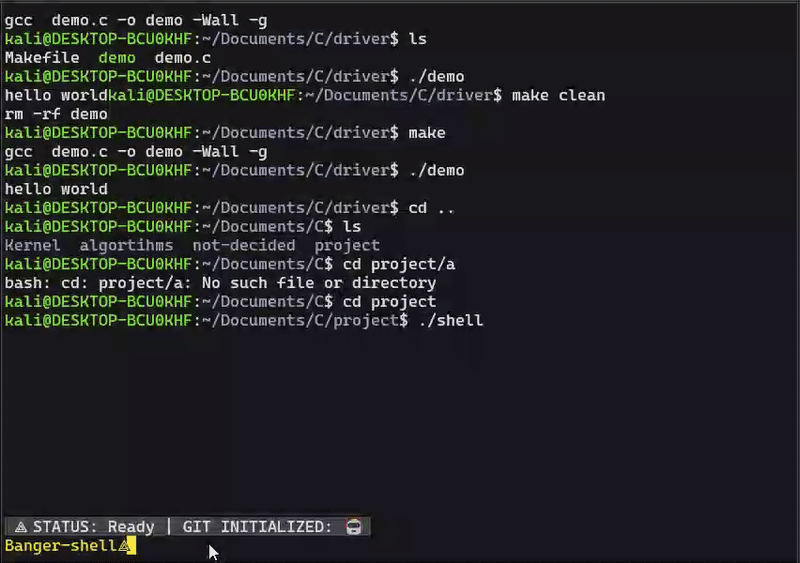

# Banger-Shell Project

This is a simple command-line shell program written in C that mimics the behavior of a Unix shell. It provides basic shell functionality such as executing commands, changing directories (`cd`), and exiting the shell. It also demonstrates process control via `fork()` and `execvp()` for running external commands.

### Features

- **Command execution**: The shell can execute any command available in the system's `PATH`.
- **Change Directory (`cd`)**: The shell supports changing directories.
- **Exit**: The shell can be exited by typing `exit`.
- **Process Management**: The shell spawns a child process to execute commands using `fork()` and `execvp()`.
- **Status reporting**: After executing a command, it reports if the process terminated normally or due to a signal.
- **Input parsing**: The shell parses the input to handle multiple arguments for each command.

### Usage

1. **Run the Shell**:  
   To start the shell, compile and run the C code:
   
   ```bash
   gcc -o banger_shell banger_shell.c
   ./banger_shell
   ```

3. **Change Directory**:
   - Use the `cd` command to change directories:
     ```bash
     Banger-shell⟁ cd /path/to/directory
     ```
   - If no directory is specified, it will print a missing argument error.

   

### Example Interaction

```bash
Banger-shell⟁ ls
file1.txt  file2.txt  directory1/

Banger-shell⟁ cd /home/user/
Banger-shell⟁ pwd
/home/user

Banger-shell⟁ exit
```

---

